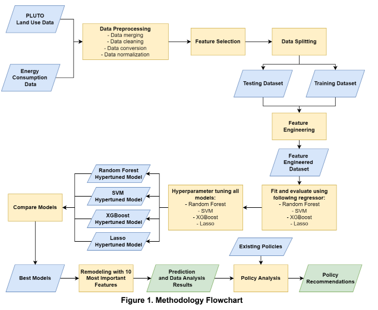
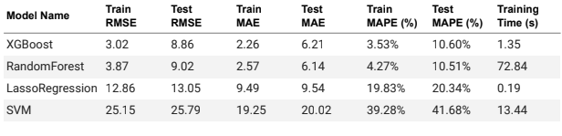
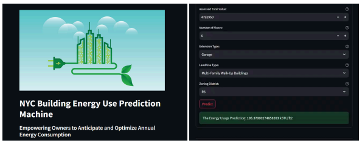

# Predicting Residential Building Energy Consumption in NYC

## Exectuive Summary

Buildings worldwide consume about 40% of energy, highlighting the need for accurate energy
forecasting to support sustainability. In New York City, Local Laws 84 and 97 mandate detailed
energy reporting and set aggressive emission limits for buildings to promote transparency and
adoption of energy-efficient practices. The integration of data-driven machine learning models
plays an essential role in these practices by enhancing the city’s ability to enforce these laws
and achieve its environmental sustainability targets. Therefore, this research utilizes several
statistical and machine learning methods such as Lasso Regression, Support Vector Machine
Regression, Random Forest Regression, and XGBoost Regression to predict energy
consumption in kBtu (kilo British thermal unit) per square feet in New York City. The results
show that the XGBoost Regressor is the most suitable model for our case in terms of error and
processing time. The feature importance analysis using XGBoost identified Energy Star Score,
Extension, and Number of Bedrooms Density per 1000 square feet as the three most important
factors for modeling. We propose that New York City introduce a Large Language Model that
provides instant access to legislation and compliance guidance, ultimately helping to simplify the
process of achieving Local Law 97 compliance.

## Problem Statement

- Accurate prediction of NYC building energy consumption requires advanced machine learning models due to complex factors like architectural design and urban density.
- Effective energy policy and efficiency measures depend on identifying key factors impacting energy use across NYC's buildings.
- Machine learning insights are crucial to supporting and enhancing New York City's sustainability and regulatory objectives.

## Research questions
- Which machine learning models provide the most accurate prediction for energy use in New York City?
- What are the critical factors that significantly affect building energy consumption in New York City?
- How can insights from machine learning modeling support the city's sustainability efforts and regulatory compliance?

## Dataset

The dataset are gathered from various sources.

| Dataset  | Source  |  Time Span | 
|---|---|---|
|  NYC Primary Land Use Tax Lot Output (PLUTO) |  [NYC Department of Planning](https://data.cityofnewyork.us/City-Government/Primary-Land-Use-Tax-Lot-Output-PLUTO-/64uk-42ks/about_data) | 2/12/2020-1/10/2024   |
|  Energy and Water Data Disclosure for Local Law 84  |  [NYC Open Data](https://data..us/Environment/Energy-and-Water-Data-Disclosure-for-Local-Law-84-/7x5e-2fxh/about_data) |  2022 |

## Project Approach

## Result
The demo of the interface is accessible through this link https://bit.ly/mlc_project_demo_group3.

